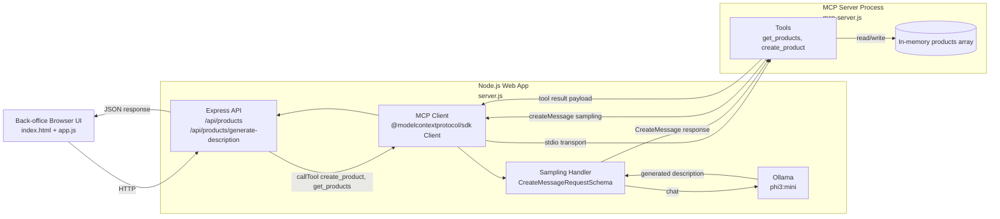

# Back office product description generator

Back-office web app where a user enters product title + keywords and generates product descriptions through MCP sampling.

## Flow

1. Browser sends `POST /api/products/generate-description` with `title` and `keywords`.
2. Express app acts as an MCP client and calls MCP tool `create_product`.
3. MCP server tool calls `server.server.createMessage(...)` (sampling).
4. The MCP client handles `CreateMessageRequestSchema`, calls Ollama, and returns text.
5. MCP server stores the created product and returns it to the web app.

## Architecture



## Prerequisites

- Node.js 18+
- Ollama installed and running locally
- A chat model available in Ollama (default used here: `phi3:mini`)

Pull model example:

```bash
ollama pull phi3:mini
```

## Install

From this folder (`Chapter-06-RAG/assignment/js-back-office`):

```bash
npm install
```

## Run

```bash
npm start
```

Open `http://localhost:3200`.

## Optional configuration

- `PORT`: web server port (default `3200`)
- `BACKOFFICE_CHAT_MODEL`: Ollama chat model used by sampling handler (default `phi3:mini`)